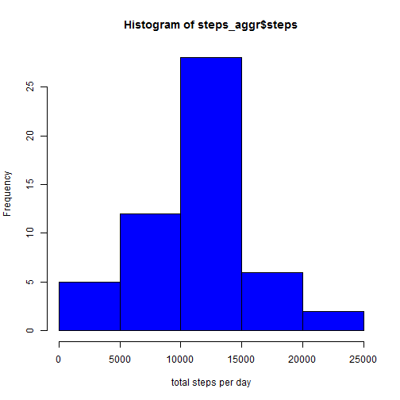
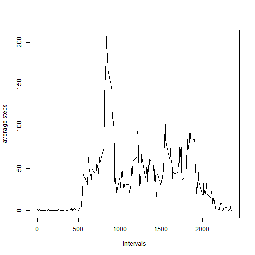
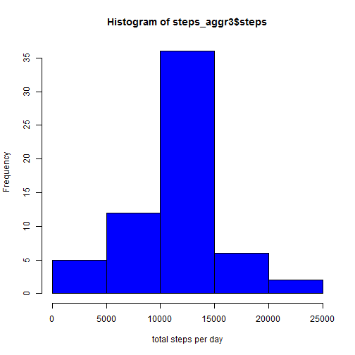
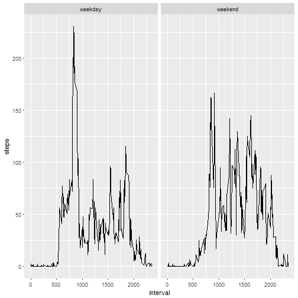

### I. Loading and preprocessing


```r
temp <- tempfile()
download.file("https://d396qusza40orc.cloudfront.net/repdata%2Fdata%2Factivity.zip",temp)
df <- unzip(temp)
unlink(temp)
df1<-read.csv2("activity.csv", header = TRUE, sep=",")
df1$date<-as.Date(df1$date, "%Y-%m-%d")
str(df1)
```

```
## 'data.frame':	17568 obs. of  3 variables:
##  $ steps   : int  NA NA NA NA NA NA NA NA NA NA ...
##  $ date    : Date, format: "2012-10-01" "2012-10-01" ...
##  $ interval: int  0 5 10 15 20 25 30 35 40 45 ...
```
### II. Mean total number of steps taken per day
#### Histogram

```r
steps_aggr<-aggregate(df1$steps~df1$date, FUN =sum)
colnames(steps_aggr)<-c("date", "steps")
hist(steps_aggr$steps, col= "blue", xlab = "total steps per day")
```



#### mean and median per day

```r
summary(steps_aggr$steps)
```

```
##    Min. 1st Qu.  Median    Mean 3rd Qu.    Max. 
##      41    8841   10760   10770   13290   21190
```
### III. The average daily activity pattern
####time series plot 

```r
df2<-df1[complete.cases(df1), ]
steps_aggr2<-aggregate(steps ~ interval, df2, FUN =  mean)
plot(steps_aggr2$interval, steps_aggr2$steps, type = "l", ylab= "average steps", xlab= "intervals")
```



####which 5-minute interval contains maximum number of steps

```r
steps_aggr2[which(steps_aggr2$steps==max(steps_aggr2$steps)),1]
```

```
## [1] 835
```
### IV. Imputing missing values
####total number of missing values in the dataset

```r
sum(is.na(df1))
```

```
## [1] 2304
```
####filling in all of the missing values in the dataset. use the mean by interval 

```r
df2<-df1
for ( i in 1:length(df2$steps)){
        if(is.na(df2$steps[i])){
                df2$steps[i]<-steps_aggr2$steps[steps_aggr2$interval==df2$interval[i]]
        }
}
sum(is.na(df2))
```

```
## [1] 0
```
####Histogram of total # steps in the new data set , mean and median

```r
steps_aggr3<-aggregate(df2$steps~df2$date, FUN = sum)
colnames(steps_aggr3)<-c("date", "steps")
hist(steps_aggr3$steps, col= "blue", xlab = "total steps per day")
```



####impact : change in the median

```r
rbind(original_data_set = summary(steps_aggr$steps), 
      new_data_set= summary(steps_aggr3$steps), impact= (summary(steps_aggr3$steps) -summary(steps_aggr$steps)))
```

```
##                   Min. 1st Qu. Median  Mean 3rd Qu.  Max.
## original_data_set   41    8841  10760 10770   13290 21190
## new_data_set        41    9819  10770 10770   12810 21190
## impact               0     978     10     0    -480     0
```
### V. Differences in activity patterns

```r
df2$WDE<-ifelse(weekdays(df2$date)%in%unique(weekdays(df2$date))[-c(6,7)], "weekday", "weekend")
df2$WDE<-as.factor(df2$WDE)
steps_aggr4<-aggregate(steps ~ interval + WDE, df2, FUN =  mean)
library(ggplot2)
g<-ggplot(steps_aggr4, aes(interval, steps))
g<-g+geom_line()
g+facet_grid(.~WDE)
```




